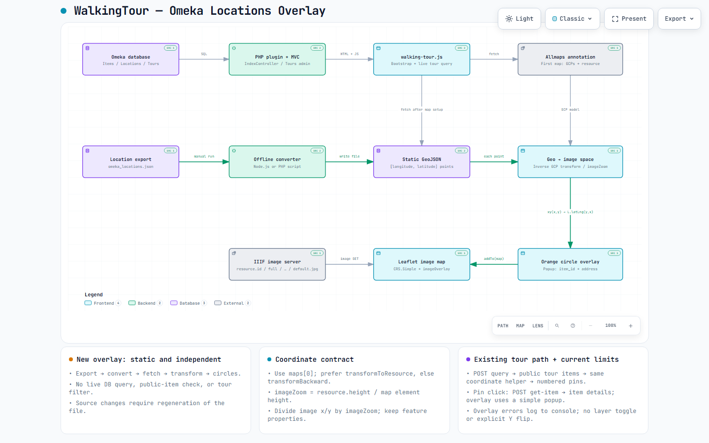

From https://github.com/tt-a1i/archify

> Snapshot notice: the diagram below describes the implementation before the dual-map batch. The current viewer uses a persistent historical-map catalog. The existing location snapshot is retained but hidden by default. The original diagram and receipts are retained unchanged.
# WalkingTour architecture and next steps

This document accompanies the **current-state** [interactive architecture diagram](walking-tour.html). The diagram describes branch `add-historic-maps1` at commit `01bf8490178124fc31052ad624436e4176874ce1`, including the “Add Omeka locations GeoJSON overlay” change. The improvements below are proposals; they are not implemented by this documentation change.



Download and open `walking-tour.html` in a browser to use the interactive viewer. The JSON source is [walking-tour.architecture.json](walking-tour.architecture.json).

## What the current diagram shows

WalkingTour is an Omeka Classic plugin. PHP controllers render the public page and query Omeka records. Browser code in `walking-tour.js` loads an Allmaps annotation, constructs a ground control point (GCP) transformer, and displays the first annotated map as an IIIF image through Leaflet's `CRS.Simple` and `imageOverlay`.

There are two separate location paths:

| Path | Data source | Browser behavior |
| --- | --- | --- |
| Existing tours | `IndexController::queryAction()` queries Locations and public Items for the selected set of available tours; returns data grouped by tour | Transforms coordinates and creates numbered tour pins. Clicking a pin can request `get-item` for details. |
| New locations overlay | An exported `omeka_locations.json` is converted offline by a Node.js or PHP script into `views/public/data/omeka-locations.geojson` | Fetches the static file, transforms each point, and adds orange circle markers with item ID and address popups. |

The overlay is attached directly to the map. It has no retained layer reference or tour-filter integration. Its converter does not join Items or check item visibility. Database changes do not update the static file automatically.

Both paths use `transformGeoPointToImagePoint()`: geographic `[longitude, latitude]` becomes image/resource `[x, y]`, each value is divided by `imageZoom`, and `imagePointToLatLng()` passes `[y, x]` to Leaflet. `imageZoom` is calculated from the image resource height and map element height. Replacing the data source does not remove the need for this transformation.

## Main development priority: query Geolocation directly

Replace the three middle steps—**Location export → Offline converter → Static GeoJSON**—with an Omeka controller endpoint that reads current locations and returns GeoJSON on request.

The proposed data path is:

```text
Browser requests locations endpoint
  → Omeka controller queries Location joined to Item
  → Filter public items and validate coordinates
  → Return geographic GeoJSON FeatureCollection
  → Existing Allmaps coordinate transformation
  → Existing Leaflet circle overlay
```

The database remains behind the PHP controller; the browser does not connect to it directly. “Live” initially means fresh data on page load or an explicit reload, not continuous polling or a WebSocket subscription.

### Changes by component

| Component | Proposed change | Reason |
| --- | --- | --- |
| `controllers/IndexController.php` | Add a dedicated locations action, for example `locationsGeojsonAction()` with proposed URL `walking-tour/index/locations-geojson`. Resolve the Location and Item tables through Omeka's database layer. | Replaces export and conversion with a request-time query; avoids hardcoding the `omeka_` table prefix. |
| Query and response | Join `locations.item_id = items.id`; restrict the public endpoint to `items.public = 1`. Return one feature per valid location row. | Avoids exposing private item locations or silently dropping multiple location rows for an item. |
| GeoJSON contract | Keep geographic coordinates as numeric `[longitude, latitude]`. Preserve `properties.id` as the **location ID**, `item_id` as the **item ID**, and the current `address`, `zoom_level`, and `map_type` fields during migration. | Lets the current renderer consume the response without changing marker identity or coordinate meaning. Tour features currently use `properties.id` for an item ID, so those contracts must not be conflated. |
| `views/public/index/index.php` and browser setup | Generate the endpoint URL with Omeka's URL helper and pass it to JavaScript. | Supports installations under a subdirectory and avoids the current hardcoded plugin asset path. |
| `loadOmekaLocationsGeojson()` | Fetch the endpoint instead of the static asset; retain the coordinate transformation and marker styling. | Keeps the first migration focused on data freshness. |
| Overlay lifecycle | Store the resulting Leaflet layer, replace it on reload, and optionally expose a visibility toggle. | Prevents duplicate markers on repeated loads and makes the independent overlay controllable. |
| Export artifacts | After the endpoint is verified, remove the production dependency on the dump, converters, and generated file. Retain only a small reviewed fixture if needed for tests. | Prevents an obsolete snapshot from remaining an accidental source of truth. |

`queryAction()` is useful implementation evidence: it already queries `$db->Location`, joins `$db->Item`, filters public items, and creates GeoJSON. However, it also requires tour membership and returns a tour-keyed response with colors and descriptions. Pointing the overlay at that response would change its scope and break its expected top-level `FeatureCollection` shape. Prefer a separate endpoint for all public geolocated items; share small query/serialization helpers only where the contracts actually match.

The existing actions reject requests that do not pass `isXmlHttpRequest()`. If the new endpoint follows that convention, the frontend's `fetch()` must send `X-Requested-With: XMLHttpRequest`, or use the existing same-origin jQuery AJAX approach. This header is a request convention, not a substitute for visibility checks.

## Additional improvements

1. **Validate data before transformation.** Reject missing, blank, nonnumeric, nonfinite, and out-of-range coordinates rather than casting them to zero. Keep valid zero coordinates. Handle an empty result as an empty `FeatureCollection`. Check the transform output and skip individual invalid points instead of aborting the entire overlay.
2. **Make failures visible.** Provide loading, empty, error, and retry states. The current overlay catch handler only writes to the console. Keep location-load errors separate from annotation/image-load errors so users can tell what failed.
3. **Render addresses as text.** The current popup concatenates `address` into HTML. Build popup DOM with `textContent` or escape the value before inserting it.
4. **Verify coordinate alignment.** Compare known locations with visible landmarks and GCPs, including near the image edges. Verify image Y-axis conventions and behavior after resizing. The current helper has no explicit Y flip; this alone does not prove a defect, so confirm the actual transformer/image convention before changing it.
5. **Keep tour behavior explicit.** Initially retain the overlay as all public geolocated items, independent of tour selection. Decide separately whether tour items should also appear as orange circles or be hidden to avoid overlapping markers. Do not implicitly restrict the new endpoint to tour members.
6. **Make map selection configurable.** The current annotation URL and `maps[0]` selection are fixed in JavaScript. A later improvement can expose the annotation/map choice through plugin configuration. Rebuild the transformer and overlay together when the selected historical map changes.
7. **Bound larger responses when needed.** Measure the deployed dataset before introducing pagination, geographic bounds filters, or caching. Any cache must have an explicit refresh/invalidation policy so item edits and visibility changes are reflected predictably.

## Suggested implementation and verification order

1. Add the dedicated endpoint and verify its response contract against a real Omeka + Geolocation installation.
2. Switch the overlay loader to the generated endpoint URL, preserving Allmaps setup and rendering order.
3. Add layer replacement, safe popup text, and visible loading/error states.
4. Confirm the checks below, then retire the static production path and regenerate the architecture diagram for the new implementation revision.

Acceptance checks for that future implementation:

- Editing a location in Omeka changes its marker after reload without running a converter.
- A public geolocated item without tour membership appears in the overlay.
- A private item does not appear for an anonymous visitor, including after a visibility change.
- Location IDs and item IDs remain distinct; multiple locations follow the documented per-row policy.
- Valid zero coordinates remain valid; malformed coordinates do not produce markers at `[0, 0]`.
- An empty dataset, a failed request, and a successful retry produce understandable states without duplicate layers.
- Addresses containing HTML-like text display as text.
- Known landmarks align with the historical map, and the existing numbered tour pins still work.
- The generated endpoint URL works when Omeka is installed below a URL subdirectory.

These are planned checks, not claims that the plugin has passed integration testing locally.

## How the diagram was generated with Archify

The diagram was created using the **Archify skill in Codex**, through a code-assisted authoring workflow. Codex inspected repository files and authored an English architecture specification; Archify rendered and validated that specification. It was not an automatic runtime trace or a reverse-engineering tool that inferred the whole application by itself.

The main evidence was:

- `WalkingTourPlugin.php`, `routes.ini`, and `plugin.ini` for plugin setup, routing, and dependencies.
- `controllers/IndexController.php` and `views/public/index/index.php` for page delivery and live tour endpoints.
- `views/public/javascripts/walking-tour.js` for annotation loading, image setup, coordinate conversion, overlay rendering, and tour interaction.
- Both `omeka-locations-to-geojson` scripts, the exported JSON, and the generated GeoJSON for the offline path.

Active code was distinguished from commented-out alternatives. In particular, the diagram shows `CRS.Simple + imageOverlay`, rather than treating older tile/warped-map experiments as the current map initialization. The overall plugin and tour path are summarized; the diagram's detailed focus is the new locations overlay.

The editable specification includes repository-relative source references pinned to the inspected commit. It was rendered with Archify 2.17, using the `architecture` diagram type, English locale, and `showcase` quality profile. Two layout correction rounds resolved label placement and desktop readability diagnostics.

To reproduce the artifact, install/provide Archify separately and run these PowerShell commands from the repository root, setting the tool path for your machine:

```powershell
$archifyCli = 'C:\path\to\archify\bin\archify.mjs'
node $archifyCli validate architecture docs/architecture/walking-tour.architecture.json --quality showcase --repo-root . --json
node $archifyCli deliver architecture docs/architecture/walking-tour.architecture.json docs/architecture/walking-tour.html --quality showcase --repo-root . --json
node $archifyCli visual-check docs/architecture/walking-tour.html --json
```

Run each command only after the previous command succeeds. The final command requires Chrome/Chromium. The checked-in HTML is self-contained; viewing it does not require Archify. If the implementation changes, update the source references and revision in the JSON before regenerating rather than presenting the original diagram as current.

The original artifact passed **9/9 showcase checks with zero composition errors or warnings**. Automated browser checks passed at 1440×900, 1600×1000, 1920×1080, and 2048×1320. Codex also visually inspected the light 1440×900 and dark 2048×1320 screenshots. These checks validate the diagram, not the running Omeka application or all interactive viewer controls.

The [delivery receipt](delivery-receipt.txt) records specification/artifact hashes and the review scope. The [browser receipt](walking-tour.visual-check.json) and [screenshot contact sheet](walking-tour.visual-check.html) preserve the automated evidence. Receipt paths reflect the original local Windows workspace and are not runtime dependencies.
